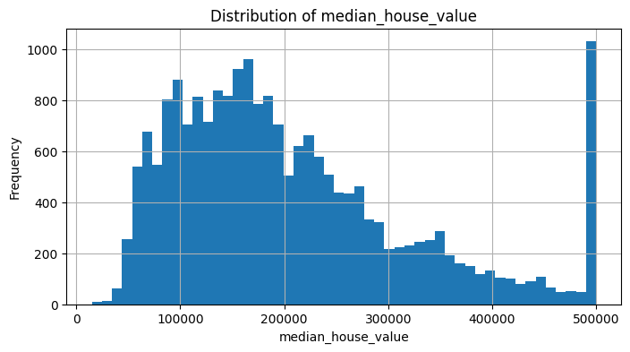

# california_housing_prices_prediction
End-to-end machine learning workflow for predicting California housing prices using the **California Housing dataset**, including EDA, preprocessing pipelines, feature engineering, and regression model training.

## Dataset

The dataset contains the following information about housing districts in California, derived from the 1990 census:

1. longitude: A measure of how far west a house is; a higher value is farther west
2. latitude: A measure of how far north a house is; a higher value is farther north
3. housingMedianAge: Median age of a house within a block; a lower number is a newer building
4. totalRooms: Total number of rooms within a block
5. totalBedrooms: Total number of bedrooms within a block
6. population: Total number of people residing within a block
7. households: Total number of households, a group of people residing within a home unit, for a block
8. medianIncome: Median income for households within a block of houses (measured in tens of thousands of US Dollars)
9. medianHouseValue: Median house value for households within a block (measured in US Dollars)
10. oceanProximity: Location of the house w.r.t ocean/sea

Target variable: **median_house_value**

---

## Exploratory Data Analysis

Initial analysis was performed to understand feature distributions, missing values, and relationships between variables.

---

## Models Evaluated

Three regression models were trained and compared using cross-validation:

- Linear Regression
- Decision Tree Regressor
- Random Forest Regressor

The **Random Forest** model achieved the best performance and was selected as the final model.

## Technologies

- Python  
- Pandas
- Seaborn
- NumPy  
- Matplotlib  
- Scikit-learn  
- Jupyter Notebook
