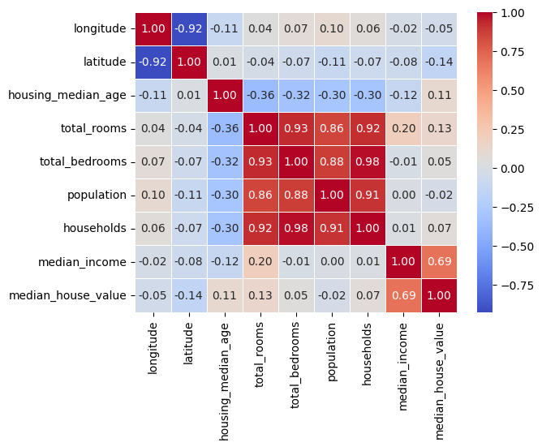
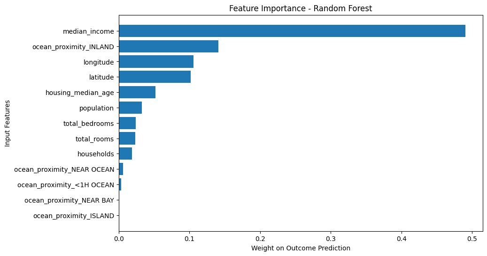

# california_housing_prices_prediction
End-to-end machine learning workflow for predicting California housing prices using the **California Housing dataset**, including EDA, preprocessing pipelines, feature engineering, and regression model training.

## Dataset

The dataset contains the following information about housing districts in California, derived from the 1990 census:

1. longitude: A measure of how far west a house is; a higher value is farther west
2. latitude: A measure of how far north a house is; a higher value is farther north
3. housingMedianAge: Median age of a house within a block; a lower number is a newer building
4. totalRooms: Total number of rooms within a block
5. totalBedrooms: Total number of bedrooms within a block
6. population: Total number of people residing within a block
7. households: Total number of households, a group of people residing within a home unit, for a block
8. medianIncome: Median income for households within a block of houses (measured in tens of thousands of US Dollars)
9. medianHouseValue: Median house value for households within a block (measured in US Dollars)
10. oceanProximity: Location of the house w.r.t ocean/sea

Target variable: **median_house_value**

---

## Exploratory Data Analysis

Initial analysis was performed to understand feature distributions, missing values, and relationships between variables.

The distribution of `median_house_value` is right-skewed, with a concentration of observations in lower price ranges and a few high-price outliers. The median house value in the dataset is approximately **$179,700**.

The correlation matrix highlights the relationships between the variables. `median_income` shows the strongest correlation with the target variable, suggesting that income levels are a key predictor of housing prices.

---

## Data Preprocessing

Before training the models, the dataset was prepared through several preprocessing steps:

- Missing values in `total_bedrooms` were imputed using the **median**, as the variable shows a right-skewed distribution and only a small number of values were missing.
- The categorical variable `ocean_proximity` was transformed using **One-Hot Encoding** so it could be used by the machine learning models.
- Numerical and categorical transformations were implemented using **scikit-learn pipelines** to ensure a consistent preprocessing workflow.

---

## Models Evaluated and their Performance

Three regression models were trained and compared using cross-validation:

- Linear Regression
- Decision Tree Regressor
- Random Forest Regressor

The models were evaluated using the **Root Mean Squared Error (RMSE)** metric and **10-fold cross-validation**.

| Model | Mean CV RMSE | Standard Deviation |
|------|------|------|
| Linear Regression | 68595.396 | 2496.524 |
| Decision Tree | 68067.945 | 2336.309 |
| Random Forest | 48851.983 | 1690.060 |

The Decision Tree achieved very low error on the training data but showed signs of overfitting during cross-validation.  
The Random Forest model achieved the lowest cross-validation error and showed better generalization compared to the other models.
Thus, as the **Random Forest** model achieved the best performance, it was selected as the final model.

**Feature importance**

The Random Forest feature importance plot shows that `median_income` is the most influential variable for predicting housing prices, followed by geographic features such as `latitude` and `longitude`.

---

## Future Improvements

Possible extensions include additional feature engineering (e.g., housing ratios such as rooms per household), broader hyperparameter optimization, and testing other ensemble methods such as Gradient Boosting.

---
## Technologies

- Python  
- Pandas
- Seaborn
- NumPy  
- Matplotlib  
- Scikit-learn  
- Jupyter Notebook
